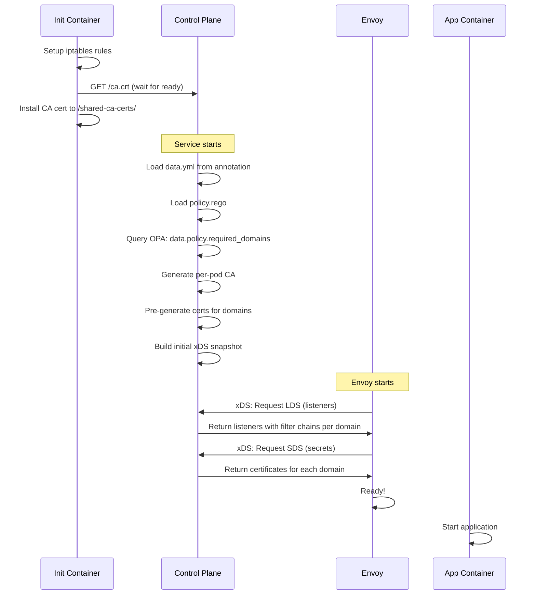
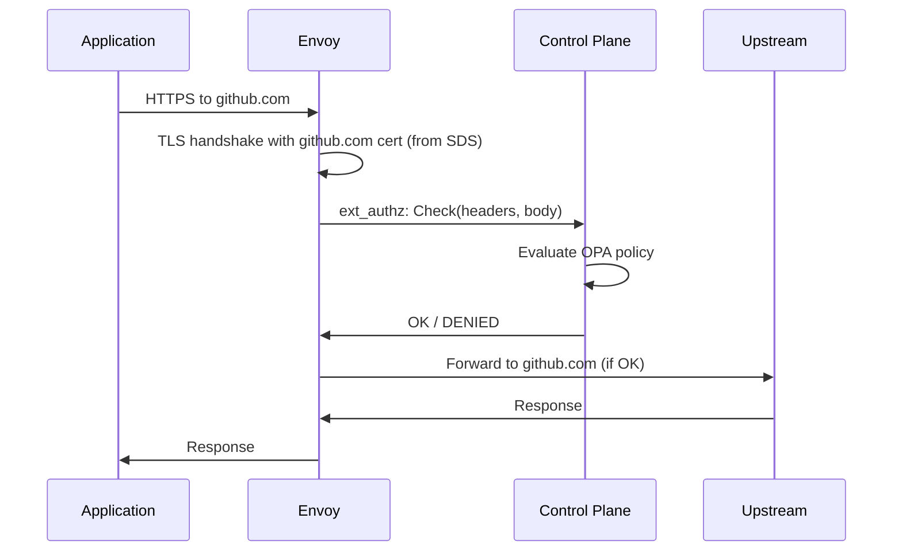

# Unified Control Plane Service Proposal

## Architecture Overview

Replace the current 3-sidecar architecture (Envoy + OPA + SDS) with a **2-sidecar architecture**:

```
┌─────────────────────────────────────────────────────┐
│  Pod (with label intercept-proxy/enabled=true)     │
├─────────────────────────────────────────────────────┤
│                                                     │
│  ┌──────────────┐          ┌──────────────────┐   │
│  │              │  xDS     │                  │   │
│  │   Envoy      │◄─────────┤  Control Plane   │   │
│  │   Proxy      │  SDS     │  Service         │   │
│  │              │  gRPC    │                  │   │
│  │  :15001      │◄─────────┤  (Go)            │   │
│  │              │ ext_authz│                  │   │
│  │              │          │  - xDS Server    │   │
│  └──────────────┘          │  - SDS Generator │   │
│         ▲                  │  - OPA Embedded  │   │
│         │ iptables         │  - ext_authz     │   │
│         │ redirect         │                  │   │
│  ┌──────┴───────┐          │  :15080 (xDS)    │   │
│  │              │          │  :15081 (HTTP)   │   │
│  │ Application  │          └──────────────────┘   │
│  │              │                                  │
│  └──────────────┘                                  │
│                                                     │
└─────────────────────────────────────────────────────┘
```

## Component Details

### 1. Unified Control Plane Service (Go)

**Responsibilities:**
- **xDS Server**: Dynamically configure Envoy listeners, clusters, routes
- **SDS Provider**: Generate TLS certificates on-demand per domain
- **OPA Integration**: Embed OPA as library for policy evaluation
- **ext_authz Server**: Implement gRPC authorization API
- **CA Management**: Generate and maintain per-pod CA certificate

**Key Libraries:**
```go
import (
    // Envoy control plane
    "github.com/envoyproxy/go-control-plane/pkg/cache/v3"
    "github.com/envoyproxy/go-control-plane/pkg/server/v3"
    "github.com/envoyproxy/go-control-plane/pkg/resource/v3"

    // OPA embedding
    "github.com/open-policy-agent/opa/rego"

    // Envoy APIs
    core "github.com/envoyproxy/go-control-plane/envoy/config/core/v3"
    listener "github.com/envoyproxy/go-control-plane/envoy/config/listener/v3"
    tlsv3 "github.com/envoyproxy/go-control-plane/envoy/extensions/transport_sockets/tls/v3"
    auth "github.com/envoyproxy/go-control-plane/envoy/service/auth/v3"
)
```

**Ports:**
- `15080`: xDS gRPC (LDS, CDS, RDS, SDS)
- `15081`: HTTP (health, CA cert download, metrics)
- `15082`: ext_authz gRPC

### 2. Configuration Flow

#### Startup Flow:



#### Request Flow:



### 3. OPA Policy Structure

**Required additions to policy.rego:**

```rego
package policy

# Main authorization decision (existing)
default allow = false

allow {
    input.method == "GET"
    input.host in data.allowed_domains
}

# NEW: Endpoint to list required domains
required_domains[domain] {
    # All explicitly allowed domains
    domain := data.allowed_domains[_]
}

required_domains[domain] {
    # Add GitHub domains if GitHub access is enabled
    data.github_read_access_enabled
    domain := ["github.com", "api.github.com", "raw.githubusercontent.com"][_]
}

required_domains[domain] {
    # Add AWS domains if AWS access is enabled
    data.aws_access_enabled
    domain := data.aws_domains[_]
}

# NEW: Helper to get all domains for xDS config
domains_for_xds := required_domains
```

**Example data.yml (from pod annotation):**

```yaml
# Pod annotation: intercept-proxy/config
allowed_domains:
  - pypi.org
  - files.pythonhosted.org
  - registry.npmjs.org

unrestricted_domains:
  - api.anthropic.com

github_read_access_enabled: true
github_allowed_users:
  - Lupus
github_allowed_repos:
  - Lupus/circuitry-cad

aws_access_enabled: false
```

### 4. xDS Configuration Generation

**Pseudo-code for building Envoy configuration:**

```go
func (cp *ControlPlane) buildSnapshot() (*cache.Snapshot, error) {
    // 1. Query OPA for required domains
    domains, err := cp.queryOPADomains()
    if err != nil {
        return nil, err
    }

    // 2. Generate certificates for each domain
    secrets := []types.Resource{}
    for _, domain := range domains {
        cert, key := cp.generateCertForDomain(domain)
        secret := &tlsv3.Secret{
            Name: fmt.Sprintf("cert-%s", domain),
            Type: &tlsv3.Secret_TlsCertificate{
                TlsCertificate: &tlsv3.TlsCertificate{
                    CertificateChain: &core.DataSource{
                        Specifier: &core.DataSource_InlineBytes{
                            InlineBytes: cert,
                        },
                    },
                    PrivateKey: &core.DataSource{
                        Specifier: &core.DataSource_InlineBytes{
                            InlineBytes: key,
                        },
                    },
                },
            },
        }
        secrets = append(secrets, secret)
    }

    // 3. Build listener with filter chain per domain
    filterChains := []*listener.FilterChain{}
    for _, domain := range domains {
        fc := &listener.FilterChain{
            FilterChainMatch: &listener.FilterChainMatch{
                ServerNames: []string{domain},
            },
            TransportSocket: &core.TransportSocket{
                Name: "envoy.transport_sockets.tls",
                ConfigType: &core.TransportSocket_TypedConfig{
                    TypedConfig: mustMarshalAny(&tlsv3.DownstreamTlsContext{
                        CommonTlsContext: &tlsv3.CommonTlsContext{
                            TlsCertificateSdsSecretConfigs: []*tlsv3.SdsSecretConfig{
                                {
                                    Name: fmt.Sprintf("cert-%s", domain),
                                    SdsConfig: &core.ConfigSource{
                                        ConfigSourceSpecifier: &core.ConfigSource_Ads{
                                            Ads: &core.AggregatedConfigSource{},
                                        },
                                    },
                                },
                            },
                        },
                    }),
                },
            },
            Filters: buildHTTPConnectionManager(domain),
        }
        filterChains = append(filterChains, fc)
    }

    // Add default/catch-all filter chain
    filterChains = append(filterChains, buildDefaultFilterChain())

    listener := &listener.Listener{
        Name: "http_listener",
        Address: &core.Address{
            Address: &core.Address_SocketAddress{
                SocketAddress: &core.SocketAddress{
                    Address: "0.0.0.0",
                    PortValue: 15001,
                },
            },
        },
        ListenerFilters: []*listener.ListenerFilter{
            {
                Name: "envoy.filters.listener.tls_inspector",
                ConfigType: &listener.ListenerFilter_TypedConfig{
                    TypedConfig: mustMarshalAny(&tlsInspector.TlsInspector{}),
                },
            },
        },
        FilterChains: filterChains,
    }

    // 4. Build clusters (dynamic forward proxy)
    clusters := []types.Resource{buildDynamicForwardProxyCluster()}

    // 5. Create snapshot
    version := atomic.AddUint64(&cp.version, 1)
    snapshot := cache.NewSnapshot(
        fmt.Sprintf("%d", version),
        map[resource.Type][]types.Resource{
            resource.EndpointType: {},
            resource.ClusterType:  clusters,
            resource.RouteType:    {},
            resource.ListenerType: {listener},
            resource.SecretType:   secrets,
        },
    )

    return snapshot, nil
}

func (cp *ControlPlane) queryOPADomains() ([]string, error) {
    query, err := cp.preparedQuery.Eval(context.Background())
    if err != nil {
        return nil, err
    }

    // Extract domains from query result
    domains := []string{}
    for _, result := range query {
        if domainSet, ok := result.Bindings["x"].([]interface{}); ok {
            for _, d := range domainSet {
                domains = append(domains, d.(string))
            }
        }
    }
    return domains, nil
}
```

### 5. ext_authz Implementation

```go
func (cp *ControlPlane) Check(ctx context.Context, req *auth.CheckRequest) (*auth.CheckResponse, error) {
    // Extract request info
    headers := req.GetAttributes().GetRequest().GetHttp().GetHeaders()
    method := req.GetAttributes().GetRequest().GetHttp().GetMethod()
    path := req.GetAttributes().GetRequest().GetHttp().GetPath()
    host := headers[":authority"]

    // Build input for OPA
    input := map[string]interface{}{
        "method": method,
        "path":   path,
        "host":   host,
        "headers": headers,
    }

    // Evaluate policy
    results, err := cp.authzQuery.Eval(ctx, rego.EvalInput(input))
    if err != nil {
        return &auth.CheckResponse{
            Status: &rpcstatus.Status{Code: int32(codes.Internal)},
        }, nil
    }

    if results.Allowed() {
        return &auth.CheckResponse{
            Status: &rpcstatus.Status{Code: int32(codes.OK)},
        }, nil
    }

    return &auth.CheckResponse{
        Status: &rpcstatus.Status{
            Code:    int32(codes.PermissionDenied),
            Message: "Denied by policy",
        },
    }, nil
}
```

## Configuration via Annotations

**Deployment example:**

```yaml
apiVersion: apps/v1
kind: Deployment
metadata:
  name: my-app
spec:
  template:
    metadata:
      labels:
        intercept-proxy/enabled: "true"
      annotations:
        # Per-pod OPA data configuration
        intercept-proxy/config: |
          allowed_domains:
            - pypi.org
            - registry.npmjs.org
          github_read_access_enabled: true
          github_allowed_users:
            - myuser
    spec:
      containers:
      - name: app
        image: my-app:latest
```

**Kyverno policy extracts annotation and passes to control plane via environment variable or mounted config.**

## Benefits

### ✅ Advantages

1. **Proper SNI Matching**: Each domain gets its own certificate with correct CN/SAN
2. **Dynamic Configuration**: Add/remove domains by updating policy without restart
3. **Simplified Deployment**: 2 sidecars instead of 3
4. **Single Source of Truth**: Policy defines both authz AND required domains
5. **Better Performance**: No inter-sidecar communication, everything in-process
6. **Easier Debugging**: Single service to check logs/metrics
7. **Configuration via Annotations**: Per-pod customization through Kubernetes native API

### ⚠️ Challenges

1. **Implementation Complexity**: More complex than current simple SDS
2. **Go Development**: Need to write ~1000 lines of Go code
3. **Testing**: Need to test xDS, SDS, ext_authz, and OPA integration
4. **Migration**: Existing deployments need update

## Implementation Plan

### Phase 1: Basic xDS + SDS (1-2 days)
- [ ] Implement basic go-control-plane server
- [ ] Generate certificates for hardcoded domain list
- [ ] Build LDS with filter chains per domain
- [ ] Build SDS with certificates
- [ ] Test with Envoy

### Phase 2: OPA Integration (1 day)
- [ ] Embed OPA rego library
- [ ] Query policy for domain list
- [ ] Update policy.rego with `required_domains` rule
- [ ] Test domain list extraction

### Phase 3: ext_authz (1 day)
- [ ] Implement ext_authz gRPC service
- [ ] Call OPA for authorization decisions
- [ ] Test policy enforcement

### Phase 4: Dynamic Configuration (1 day)
- [ ] Read config from annotation/ConfigMap
- [ ] Watch for config changes
- [ ] Rebuild snapshot on change
- [ ] Test configuration updates

### Phase 5: Integration & Testing (2 days)
- [ ] Update Helm chart
- [ ] Update Kyverno policy injection
- [ ] End-to-end testing
- [ ] Documentation

**Total Estimate: 6-7 days**

## Alternative: Hybrid Approach

If full implementation is too complex, consider a **hybrid approach**:

1. **Keep OPA as separate sidecar** for ext_authz
2. **Keep SDS separate** but query OPA for domain list via HTTP
3. Only implement **domain list endpoint** in OPA policy

This reduces scope but still solves the SNI matching problem.

**OPA query endpoint:**
```bash
curl http://localhost:15020/v1/data/policy/required_domains
{
  "result": ["github.com", "api.github.com", "pypi.org"]
}
```

**SDS startup:**
```go
// Query OPA for domains
resp, _ := http.Get("http://localhost:15020/v1/data/policy/required_domains")
var domains []string
json.NewDecoder(resp.Body).Decode(&domains)

// Tell Envoy about these domains via xDS
buildFilterChains(domains)
```

## Recommendation

I recommend **starting with the hybrid approach** to validate the concept, then migrate to the unified service if it proves successful.

The hybrid approach:
- ✅ Solves the SNI matching problem
- ✅ Uses policy as single source of truth
- ✅ Requires minimal changes to existing code
- ✅ Can be done in 2-3 days
- ✅ Easy to test and rollback

Then evaluate if the unified service provides enough benefits to justify the additional complexity.
